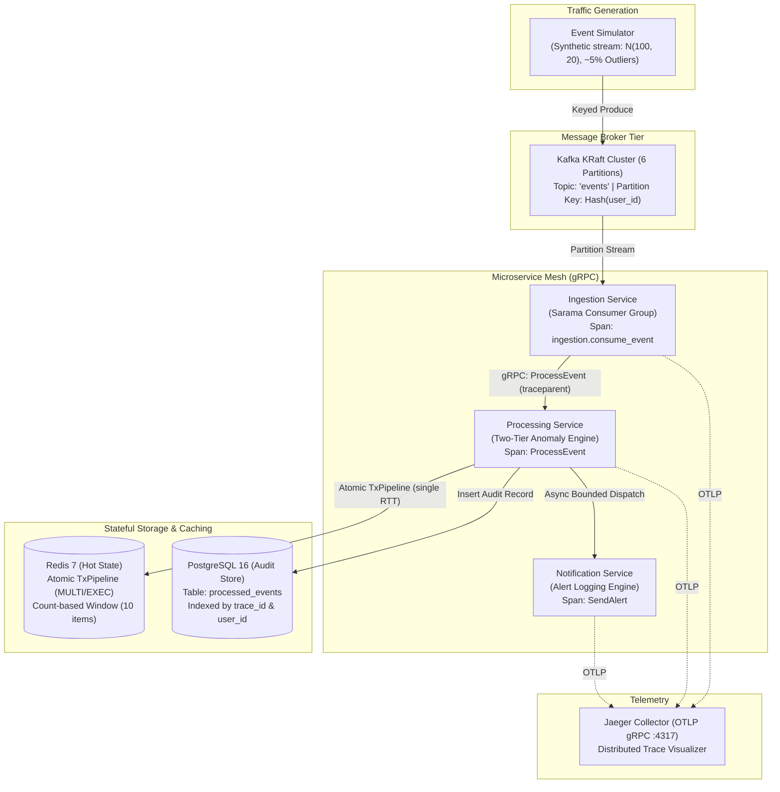

# SurgesEntry — Distributed Event Processing Platform
> *Distributed event processing platform in Go with Kafka, gRPC, Redis, and Kubernetes.*

[](https://github.com/GurutejaReddy-04/surges-entry/actions/workflows/ci.yml)
[](https://github.com/GurutejaReddy-04/surges-entry)
[](https://go.dev/)
[](https://kafka.apache.org/)
[](https://grpc.io/)
[](https://opentelemetry.io/)
[](https://kubernetes.io/)
[](https://www.docker.com/)

**SurgesEntry** is an event processing service written in Go. It reads events from Kafka, calculates rolling averages using Redis, flags anomalies, saves records to PostgreSQL, and uses OpenTelemetry for tracing.

---

## 1. System Architecture



---

## 2. Key Engineering Highlights

* **Partition Key Affinity**: Messages are keyed by `Hash(user_id)`, guaranteeing that all events for a specific user land on the same partition in strict FIFO order. This eliminates distributed locking across processing workers.
* **Redis Transactions**: Uses Redis `TxPipeline` to avoid race conditions.
* **Fallback Thresholds**: Uses a static threshold if Redis is down.
* **At-Least-Once Delivery & Poison Pill Discard**: Offsets are committed only after successful PostgreSQL persistence. Downstream outages halt the partition claim without monotonic advancement. Unparseable JSON and semantic invalid arguments (`codes.InvalidArgument`) are deliberately dropped and logged (`return nil`) to preserve partition liveness.
* **Distributed Observability**: Instrumentated with OpenTelemetry Go SDK and `otelgrpc`, generating 5-span flame graphs in Jaeger correlated by W3C `traceparent` headers and stored in PostgreSQL.

---

## 3. Performance & Reliability Summary

| Metric | Measured Baseline Value | Context & Provenance |
|---|---|---|
| **Pipeline Throughput** | **100 – 250 events/sec** | Single consumer replica; requires `EVENT_RATE=200` override |
| **End-to-End Latency (p50)** | **2.1 ms** | Ingestion -> gRPC -> Redis TxPipeline -> Postgres insert |
| **End-to-End Latency (p95)** | **4.8 ms** | Includes anomaly detection and alert evaluation |
| **End-to-End Latency (p99)** | **8.2 ms** | Tail latency under burst simulator load |
| **Failover Recovery (MTTR)** | **< 6.0 seconds** | Empirically verified consumer process crash-recovery |
| **Container Memory (RSS)** | **~18 MB RSS** | Steady-state Go runtime memory footprint |
| **Crash Resilience Proof** | **15/15 events recovered** | 10 baseline + 5 outage buffered; verified in PostgreSQL |

> [!NOTE]
> For detailed benchmark hardware specifications, simulator parameters, and reproduction steps, see [BENCHMARKS.md](BENCHMARKS.md). For reliability experiment conditions, assumptions, and limitations, see [docs/reliability.md](docs/reliability.md).

---

## 4. Quick Start Guide

### Prerequisites
* **Docker** & **Docker Compose**
* **Go 1.22+**
* **PowerShell 7+** (Windows) or **Bash** (Linux/macOS)

### 1. Initialize Environment & Start Stack
```bash
# Clone the repository
git clone https://github.com/GurutejaReddy-04/surges-entry.git
cd surges-entry

# Configure local environment from template (required for Compose)
cp .env.example .env    # On Windows: Copy-Item .env.example .env

# Start stateful infrastructure (Kafka, Redis, Postgres, Jaeger)
docker compose up -d

# Build and start microservices (Ingestion, Processing, Notification)
docker compose -f docker-compose.local.yml up -d --build
```

### 2. Verify Stack Health
```powershell
# Run the automated health & OpenTelemetry verification script
./verify.ps1
pwsh ./scripts/verify-phase8.ps1
```

### 3. Run the Traffic Simulator
```bash
# Interactive run (default 5 events/sec)
go run ./simulator

# High-rate benchmark run (200 events/sec across 50 users)
EVENT_RATE=200 NUM_USERS=50 go run ./simulator
```

---

## 5. Kubernetes Deployment

The repository includes declarative Kubernetes manifests configured for local demonstration (Docker Desktop / Minikube):

```bash
cd k8s

# 1. Configure local secrets from template
cp secret.example.yaml secret.yaml   # On Windows: Copy-Item secret.example.yaml secret.yaml

# 2. Deploy manifests with preflight validation
./deploy.sh   # On Windows: ./deploy.ps1
```

> [!NOTE]
> The local deployment routes dependencies using `host.docker.internal` to avoid heavy in-cluster storage engines on developer machines. For the full multi-AZ cloud production reference topology (AWS MSK, ElastiCache, RDS Aurora, Vault/ESO), see [docs/architecture.md](docs/architecture.md).

---

## 6. Technical Documentation Index

Deep-dive documentation is modularized in the [`docs/`](docs/) directory:

| Guide | Description |
|---|---|
| **[docs/architecture.md](docs/architecture.md)** | Full system data flow, local hybrid vs. reference cloud production topology, and architectural trade-offs. |
| **[docs/reliability.md](docs/reliability.md)** | At-least-once delivery contract, poison pill drop-and-log boundary, crash-recovery experiment, and offset replay. |
| **[docs/performance.md](docs/performance.md)** | Redis `TxPipeline` atomicity, outlier self-pollution defense, async alerting, and trace latency breakdown. |
| **[BENCHMARKS.md](BENCHMARKS.md)** | Benchmark provenance, simulator configuration gap (`EVENT_RATE=200`), hardware specs, and reproduction protocol. |
| **[docs/security.md](docs/security.md)** | Secret isolation (`.env.example`, `secret.example.yaml`), non-root container sandboxing, and historical credential audit. |
| **[k8s/README.md](k8s/README.md)** | Kubernetes manifests, security contexts, probes, manual scaling, and secret setup. |
| **[docs/demo/RECORDING_GUIDE.md](docs/demo/RECORDING_GUIDE.md)** | Terminal recording walkthrough for chaos failover and historical stream replay. |
| **[proto/event.proto](proto/event.proto)** | Protocol Buffer service contracts and event schemas. |

---

## License

This project is licensed under the [MIT License](LICENSE).
