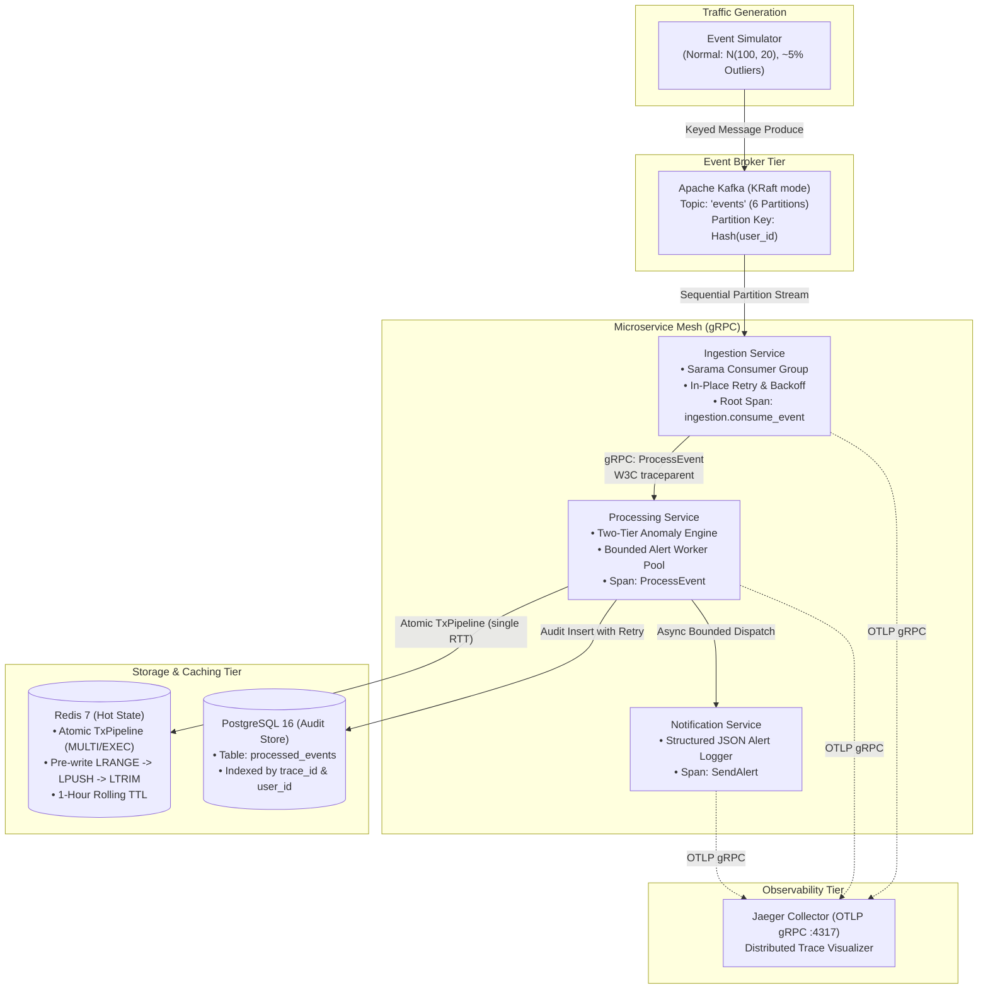
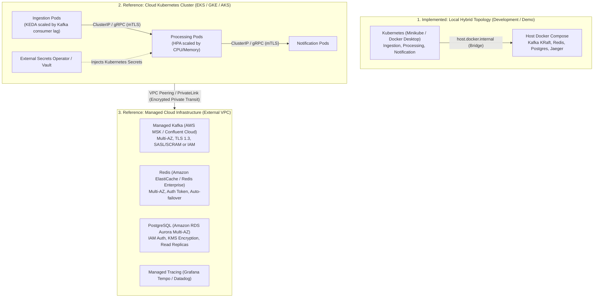

# SurgesEntry — Architecture Overview
> *Distributed Event Processing Platform*

---

## 1. System Overview

**SurgesEntry** is a distributed stream processing platform engineered in Go. It ingests high-throughput telemetry events, computes per-user real-time sliding window statistics in an in-memory cache, executes two-tier anomaly detection, writes immutable audit trails to persistent storage, and propagates distributed traces end-to-end across a gRPC microservice mesh.

---

## 2. Microservice Decomposition

### 2.1 Ingestion Service (`services/ingestion/`)
* **Role**: Ingests raw JSON payloads from Kafka topic partitions.
* **Key Design Decisions**:
  * **Partition Sequential Processing**: Reads events in strict partition sequence to maintain per-user FIFO ordering.
  * **Offset Advancement Defense**: Executes in-place exponential retries (up to 3 attempts) for transient errors. If an error is unrecoverable (e.g., PostgreSQL or Processing returns `codes.Unavailable`), it halts the partition claim immediately without marking the offset.
  * **Poison Pill Drop-and-Log Boundary**: Discards malformed JSON and semantic argument errors (`codes.InvalidArgument`) cleanly (`return nil`) to prevent infinite partition stall loops while logging discard diagnostics.
  * **Root Span Generation**: Initiates the root W3C trace span `ingestion.consume_event` with partition and offset attributes, injecting trace context into outgoing gRPC metadata via `otelgrpc`.

### 2.2 Processing Service (`services/processing/`)
* **Role**: Computes sliding rolling-window statistics, detects statistical anomalies, and logs audit events.
* **Key Design Decisions**:
  * **Decoupled Pre-Write Window Read**: Uses Redis `TxPipeline` to issue `LRANGE` before `LPUSH`, computing baseline statistics strictly from historical events so incoming spikes do not contaminate their own detection baseline.
  * **Two-Tier Anomaly Engine**:
    * **Tier 1 (Dynamic)**: Evaluates `value > 1.5 × rolling_avg`.
    * **Tier 2 (Static Fallback)**: If Redis is unavailable or on cold-start (empty window), falls back to `value > 1000.0`.
  * **PostgreSQL Audit Store**: Persists records with computed rolling averages, anomaly flags, and 32-hex `trace_id`.
  * **Decoupled Alert Dispatch**: Routes anomaly alerts through a bounded in-memory worker queue (buffer size 1000, 2 concurrent workers) so slow notification RPCs never block the core processing path.

### 2.3 Notification Service (`services/notification/`)
* **Role**: Receives anomaly alerts over gRPC and emits structured JSON alert logs.
* **Key Design Decisions**:
  * Emits standardized structured log records with `trace_id`, `user_id`, `value`, `rolling_avg`, and `timestamp`.
  * Fully instrumented with `otelgrpc.NewServerHandler()`, completing the 5-span distributed trace.

---

## 3. Deployment Topologies: Local Hybrid vs. Reference Production Architecture

To clearly distinguish between the local demonstration environment and cloud deployments, SurgesEntry delineates its topologies as follows:

### 3.1 Implemented: Local Hybrid Topology
* **Purpose**: Allows complete local demonstration on developer workstations without running resource-heavy StatefulSets or PersistentVolumes inside Minikube.
* **Mechanism**: Microservices run in Kubernetes (`surges-entry` namespace) or Docker Compose, while stateful datastores run in host Docker Compose.
* **Networking**: Containers reach host ports via `host.docker.internal` (Docker Desktop) or bridge IP (Minikube).

### 3.2 Reference: Production Cloud Architecture
In a production deployment, the architecture transitions to a cloud-native model with the following modifications:
1. **Networking**:
   - `host.docker.internal` is completely removed.
   - Microservices communicate across private subnets via VPC Peering, AWS PrivateLink, or Azure Private Endpoints.
   - In-cluster service communication uses Kubernetes `ClusterIP` and Headless Services with mutual TLS (mTLS).
2. **Security & Secrets**:
   - Connection strings are not stored in plaintext manifests.
   - Kubernetes Secrets are injected dynamically using **External Secrets Operator (ESO)** backed by AWS Secrets Manager or HashiCorp Vault.
   - Database authentication leverages IAM database authentication (e.g., AWS RDS IAM auth) with short-lived tokens.
   - Kafka authentication uses SASL/SCRAM-SHA-512 or AWS IAM.
3. **High Availability & Fault Domains**:
   - Managed Kafka deployed across 3 Availability Zones with minimum in-sync replicas (`RF ≥ 3`, `ISR ≥ 2`).
   - Managed Redis deployed with Multi-AZ replication and automated cluster failover.
   - Managed PostgreSQL deployed in active-standby Multi-AZ with automated storage autoscaling.
4. **Autoscaling**:
   - Ingestion pods scale automatically via **KEDA** (Kubernetes Event-driven Autoscaling) monitoring Kafka partition consumer lag.
   - Processing pods scale via Kubernetes HPA driven by CPU and custom request latency metrics.

---

## 4. Resilience & Fault-Tolerance Contract

SurgesEntry provides an **at-least-once delivery contract for valid messages**, intentionally isolating or discarding unrecoverable payloads:

| Failure Scenario | Mitigation Strategy | Observed / Architectural Result |
| :--- | :--- | :--- |
| **Ingestion Pod Crash** | Kafka retains partition high-water mark; Kubernetes restarts pod | Pod resumes consumption from last committed offset under at-least-once semantics. |
| **Downstream Outage (Postgres / Processing)** | Ingestion halts partition consumption without marking offset | Offsets remain intact; stream pauses safely until downstream self-heals. |
| **Redis Cache Outage** | Isolated error boundary in Processing; falls back to Tier-2 static threshold | Processing continues seamlessly; audit logs preserved; zero pipeline interruption. |
| **Notification RPC Lag** | Asynchronous bounded worker channel (`alertQueue`, buffer 1000) | Core event processing latency is completely isolated from alert delivery delays. |
| **Poison Pill / Malformed JSON** | Parser validates schemas; poison pill logs diagnostic reason and drops cleanly | Message discarded (`return nil`) to prevent infinite partition consumer stalls. |

*(For detailed experimental conditions, see [docs/reliability.md](reliability.md).)*

---

## 5. Distributed Tracing Flow

Each event generates a unified 5-span flame graph linked by W3C `traceparent` metadata:
1. `ingestion.consume_event` (Ingestion internal span)
2. `client: event.ProcessingService/ProcessEvent` (Ingestion gRPC client)
3. `server: event.ProcessingService/ProcessEvent` (Processing gRPC server)
4. `client: event.NotificationService/SendAlert` (Processing gRPC client, anomalies only)
5. `server: event.NotificationService/SendAlert` (Notification gRPC server)
