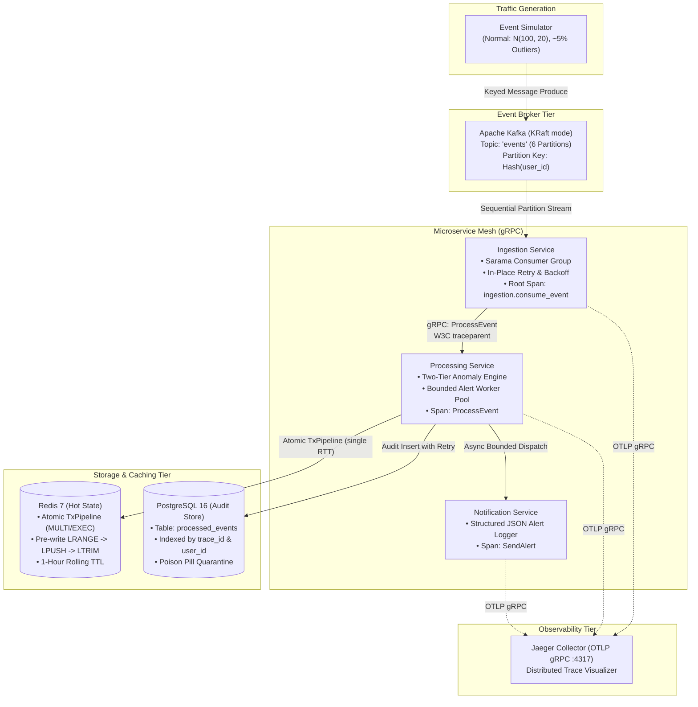

# SurgesEntry — Architecture Overview
> *Distributed Event Processing Platform*

## 1. System Overview

**SurgesEntry** is a production-grade, distributed stream processing platform engineered in Go. It ingests high-throughput telemetry events, computes per-user real-time sliding window statistics in an in-memory cache, executes two-tier anomaly detection, writes immutable audit trails to persistent storage, and propagates distributed traces end-to-end across a gRPC microservice mesh.

---

## 2. Microservice Decomposition

### 2.1 Ingestion Service (`services/ingestion/`)
* **Role**: Ingests raw JSON payloads from Kafka topic partitions.
* **Key Design Decisions**:
  * **Partition Sequential Processing**: Reads events in strict partition sequence to maintain strict FIFO per-user ordering.
  * **Offset Advancement Defense**: Executes in-place exponential retries (up to 3 attempts) for transient errors. If an error is unrecoverable (e.g., PostgreSQL or Processing downstream returns `codes.Unavailable`), it halts the partition claim immediately without marking the offset. This guarantees zero message loss and prevents Kafka's monotonic offset advancement bug.
  * **Root Span Generation**: Initiates the root W3C trace span `ingestion.consume_event` with partition and offset attributes, injecting trace context into outgoing gRPC metadata via `otelgrpc`.

### 2.2 Processing Service (`services/processing/`)
* **Role**: Computes sliding rolling-window statistics, detects statistical anomalies, and logs audit events.
* **Key Design Decisions**:
  * **Decoupled Pre-Write Window Read**: Uses Redis `TxPipeline` to issue `LRANGE` before `LPUSH`, computing baseline statistics strictly from historical events so incoming spikes do not contaminate their own detection baseline.
  * **Two-Tier Anomaly Engine**:
    * **Tier 1 (Dynamic)**: Evaluates $value > 1.5 \times \text{rolling\_avg}$.
    * **Tier 2 (Static Fallback)**: If Redis is unavailable or on cold-start (empty window), falls back to $value > 1000.0$.
  * **PostgreSQL Audit Store**: Persists records with computed rolling averages, anomaly flags, and 32-hex `trace_id`.
  * **Decoupled Alert Dispatch**: Routes anomaly alerts through a bounded in-memory worker queue (buffer size 1000, 2 concurrent workers) so slow notification RPCs never block the core processing path.

### 2.3 Notification Service (`services/notification/`)
* **Role**: Receives anomaly alerts over gRPC and emits structured JSON alert logs.
* **Key Design Decisions**:
  * Emits standardized structured log records with `trace_id`, `user_id`, `value`, `rolling_avg`, and `timestamp`.
  * Fully instrumented with `otelgrpc.NewServerHandler()`, completing the 5-span distributed trace.

---

## 3. Resilience & Fault-Tolerance Guarantees

| Failure Scenario | Mitigation Strategy | Result |
| :--- | :--- | :--- |
| **Ingestion Pod Crash** | Kafka maintains partition high-water mark; Kubernetes restarts pod | Pod resumes consumption from last committed offset. **Zero data loss**. |
| **Downstream Outage (Postgres / Processing)** | Ingestion stops marking offsets and halts partition consumption | Offsets remain intact; stream pauses until downstream self-heals. |
| **Redis Cache Outage** | Isolated error boundary in Processing; falls back to Tier-2 static threshold | Processing continues seamlessly; audit logs preserved; zero pipeline halts. |
| **Notification RPC Lag** | Asynchronous bounded worker channel (`alertQueue`) drops excess non-blocking warnings | Core event processing latency is completely isolated from alert delivery delays. |
| **Poison Pill / Malformed JSON** | Parser validates schemas; poison pill logs quarantine reason and drops cleanly | Prevents infinite crash-loops while preserving partition progress for healthy events. |

---

## 4. Distributed Tracing Flow

Each event generates a unified 5-span flame graph linked by W3C `traceparent` metadata:
1. `ingestion.consume_event` (Ingestion internal span)
2. `client: event.ProcessingService/ProcessEvent` (Ingestion gRPC client)
3. `server: event.ProcessingService/ProcessEvent` (Processing gRPC server)
4. `client: event.NotificationService/SendAlert` (Processing gRPC client, anomalies only)
5. `server: event.NotificationService/SendAlert` (Notification gRPC server)
